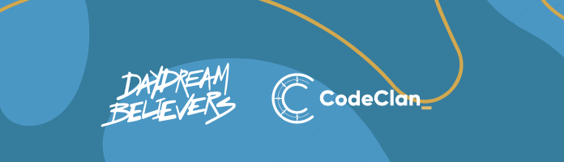
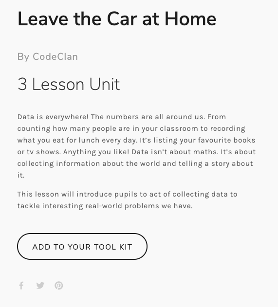
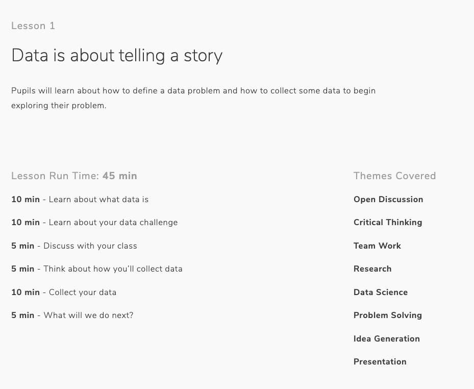
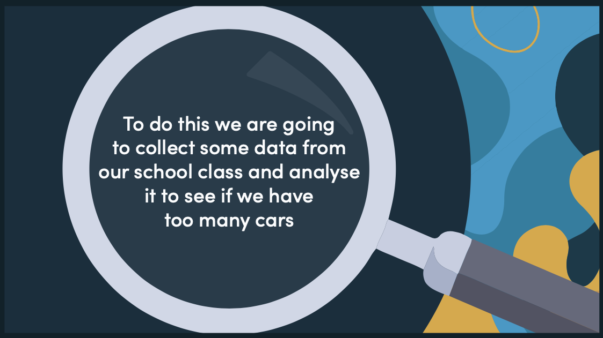
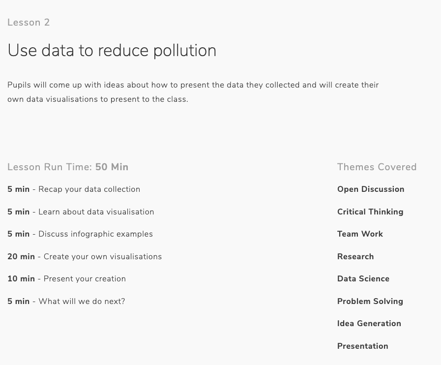
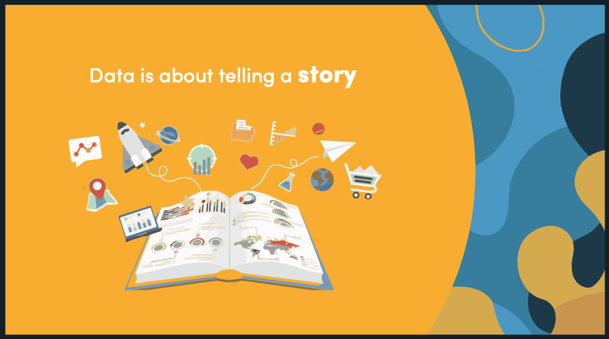
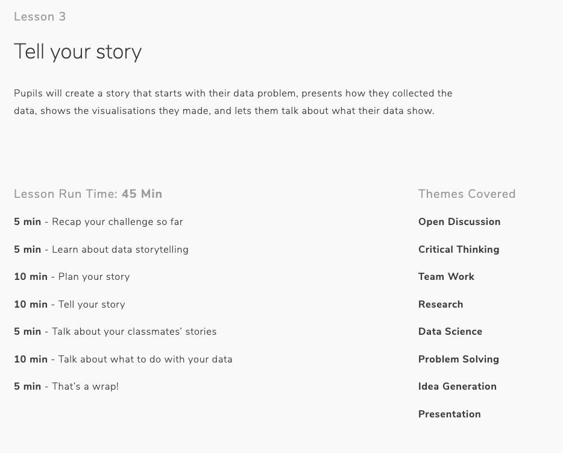
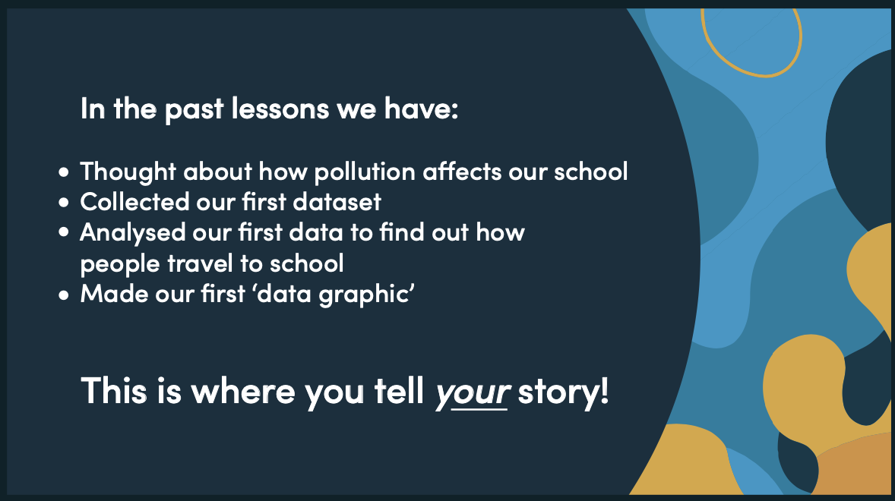

# Daydream Believers and CodeClan

 

Here you can find a set of three lessons created for DDB. 

> Daydream Believers resources put creativity at the heart of education by uniting the skills and insights of employers, teachers, lecturers and students.

[You can find all the published lessons here](https://daydreambelievers.co.uk/resources/codeclan-leave-the-car-at-home)

 

## Leave the Car at Home Project

 

 

 

 

  

 

 

 

